# Download data
wget https://cf.10xgenomics.com/samples/cell/pbmc3k/pbmc3k_filtered_gene_bc_matrices.tar.gz
tar zxvf pbmc3k_filtered_gene_bc_matrices.tar.gz

#stored data  @data/

```R
ptm <- proc.time()

library(dplyr)
library(Seurat)
library(patchwork)

options(repr.plot.width=15, repr.plot.height=7)
```

    
    Attaching package: ‘dplyr’
    
    
    The following objects are masked from ‘package:stats’:
    
        filter, lag
    
    
    The following objects are masked from ‘package:base’:
    
        intersect, setdiff, setequal, union
    
    


```R
# Load the PBMC dataset
pbmc.data <- Read10X(data.dir = "data/")

# Initialize the Seurat object with the raw (non-normalized data).
pbmc <- CreateSeuratObject(counts = pbmc.data, project = "pbmc3k", min.cells = 3, min.features = 200)
pbmc
```

    Warning message:
    “Feature names cannot have underscores ('_'), replacing with dashes ('-')”


    An object of class Seurat 
    13714 features across 2700 samples within 1 assay 
    Active assay: RNA (13714 features, 0 variable features)


```R
# The [[ operator can add columns to object metadata. This is a great place to stash QC stats
pbmc[["percent.mt"]] <- PercentageFeatureSet(pbmc, pattern = "^MT-")
```


```R
# Visualize QC metrics as a violin plot
VlnPlot(pbmc, features = c("nFeature_RNA", "nCount_RNA", "percent.mt"), ncol = 3)
```


    
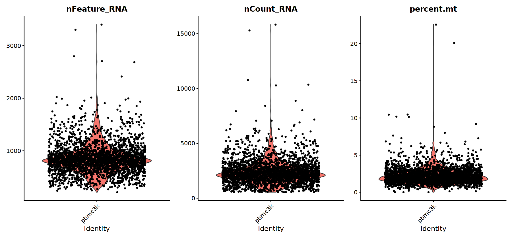
    


```R
# FeatureScatter is typically used to visualize feature-feature relationships, but can be used
# for anything calculated by the object, i.e. columns in object metadata, PC scores etc.

plot1 <- FeatureScatter(pbmc, feature1 = "nCount_RNA", feature2 = "percent.mt")
plot2 <- FeatureScatter(pbmc, feature1 = "nCount_RNA", feature2 = "nFeature_RNA")
plot1 + plot2
```


    
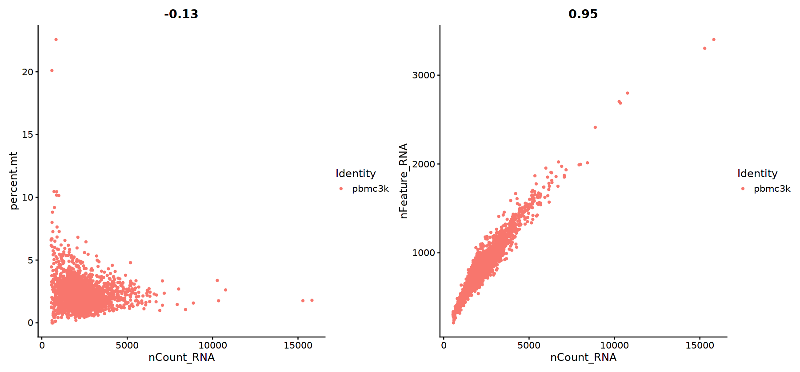
    


```R
pbmc <- subset(pbmc, subset = nFeature_RNA > 200 & nFeature_RNA < 2500 & percent.mt < 5)
```


```R
# Normalizing data

pbmc <- NormalizeData(pbmc, normalization.method = "LogNormalize", scale.factor = 10000)
```


```R
# Identification of highly variable features (feature selection)

pbmc <- FindVariableFeatures(pbmc, selection.method = "vst", nfeatures = 2000)

# Identify the 10 most highly variable genes
top10 <- head(VariableFeatures(pbmc), 10)
```


```R
# plot variable features with and without labels
plot1 <- VariableFeaturePlot(pbmc)
plot1
```

    Warning message:
    “Transformation introduced infinite values in continuous x-axis”


    

    


```R
plot2 <- LabelPoints(plot = plot1, points = top10, repel = TRUE)
plot2
```

    When using repel, set xnudge and ynudge to 0 for optimal results
    
    Warning message:
    “Transformation introduced infinite values in continuous x-axis”


    
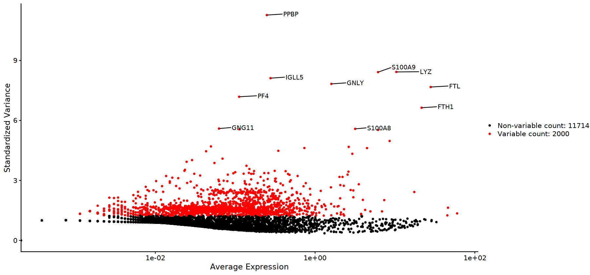
    


```R
# Scaling the data 

all.genes <- rownames(pbmc)
pbmc <- ScaleData(pbmc, features = all.genes)
```

    Centering and scaling data matrix
    


```R
# Performing linear dimensional reduction

pbmc <- RunPCA(pbmc, features = VariableFeatures(object = pbmc))
```

    PC_ 1 
    Positive:  CST3, TYROBP, LST1, AIF1, FTL, FTH1, LYZ, FCN1, S100A9, TYMP 
    	   FCER1G, CFD, LGALS1, S100A8, CTSS, LGALS2, SERPINA1, IFITM3, SPI1, CFP 
    	   PSAP, IFI30, SAT1, COTL1, S100A11, NPC2, GRN, LGALS3, GSTP1, PYCARD 
    Negative:  MALAT1, LTB, IL32, IL7R, CD2, B2M, ACAP1, CD27, STK17A, CTSW 
    	   CD247, GIMAP5, AQP3, CCL5, SELL, TRAF3IP3, GZMA, MAL, CST7, ITM2A 
    	   MYC, GIMAP7, HOPX, BEX2, LDLRAP1, GZMK, ETS1, ZAP70, TNFAIP8, RIC3 
    PC_ 2 
    Positive:  CD79A, MS4A1, TCL1A, HLA-DQA1, HLA-DQB1, HLA-DRA, LINC00926, CD79B, HLA-DRB1, CD74 
    	   HLA-DMA, HLA-DPB1, HLA-DQA2, CD37, HLA-DRB5, HLA-DMB, HLA-DPA1, FCRLA, HVCN1, LTB 
    	   BLNK, P2RX5, IGLL5, IRF8, SWAP70, ARHGAP24, FCGR2B, SMIM14, PPP1R14A, C16orf74 
    Negative:  NKG7, PRF1, CST7, GZMB, GZMA, FGFBP2, CTSW, GNLY, B2M, SPON2 
    	   CCL4, GZMH, FCGR3A, CCL5, CD247, XCL2, CLIC3, AKR1C3, SRGN, HOPX 
    	   TTC38, APMAP, CTSC, S100A4, IGFBP7, ANXA1, ID2, IL32, XCL1, RHOC 
    PC_ 3 
    Positive:  HLA-DQA1, CD79A, CD79B, HLA-DQB1, HLA-DPB1, HLA-DPA1, CD74, MS4A1, HLA-DRB1, HLA-DRA 
    	   HLA-DRB5, HLA-DQA2, TCL1A, LINC00926, HLA-DMB, HLA-DMA, CD37, HVCN1, FCRLA, IRF8 
    	   PLAC8, BLNK, MALAT1, SMIM14, PLD4, LAT2, P2RX5, IGLL5, SWAP70, FCGR2B 
    Negative:  PPBP, SDPR, PF4, SPARC, GNG11, NRGN, GP9, RGS18, TUBB1, CLU 
    	   HIST1H2AC, AP001189.4, ITGA2B, CD9, TMEM40, PTCRA, CA2, ACRBP, MMD, TREML1 
    	   NGFRAP1, F13A1, SEPT5, RUFY1, TSC22D1, MPP1, CMTM5, RP11-367G6.3, MYL9, GP1BA 
    PC_ 4 
    Positive:  HLA-DQA1, CD79B, CD79A, MS4A1, HLA-DQB1, CD74, HLA-DPB1, HIST1H2AC, TCL1A, HLA-DPA1 
    	   HLA-DRB1, PF4, HLA-DQA2, SDPR, HLA-DRA, LINC00926, PPBP, GNG11, HLA-DRB5, SPARC 
    	   GP9, AP001189.4, CA2, PTCRA, CD9, GZMB, NRGN, RGS18, CLU, TUBB1 
    Negative:  VIM, IL7R, S100A6, IL32, S100A8, S100A4, GIMAP7, S100A10, S100A9, MAL 
    	   AQP3, CD2, CD14, FYB, LGALS2, GIMAP4, ANXA1, CD27, RBP7, FCN1 
    	   LYZ, GIMAP5, S100A11, S100A12, MS4A6A, FOLR3, TRABD2A, AIF1, IL8, TMSB4X 
    PC_ 5 
    Positive:  GZMB, S100A8, NKG7, FGFBP2, GNLY, CCL4, CST7, PRF1, GZMA, SPON2 
    	   GZMH, S100A9, LGALS2, CCL3, CTSW, XCL2, CD14, CLIC3, S100A12, CCL5 
    	   RBP7, MS4A6A, GSTP1, FOLR3, IGFBP7, TYROBP, AKR1C3, TTC38, XCL1, HOPX 
    Negative:  LTB, IL7R, CKB, VIM, MS4A7, AQP3, CYTIP, RP11-290F20.3, SIGLEC10, HMOX1 
    	   LILRB2, PTGES3, HN1, MAL, CD27, GDI2, CD2, ANXA5, CORO1B, TUBA1B 
    	   FAM110A, ATP1A1, TRADD, PPA1, CCDC109B, ABRACL, CTD-2006K23.1, WARS, VMO1, IFITM2 
    


```R
# Examine and visualize PCA results a few different ways
print(pbmc[["pca"]], dims = 1:5, nfeatures = 5)
```

    PC_ 1 
    Positive:  CST3, TYROBP, LST1, AIF1, FTL 
    Negative:  MALAT1, LTB, IL32, IL7R, CD2 
    PC_ 2 
    Positive:  CD79A, MS4A1, TCL1A, HLA-DQA1, HLA-DQB1 
    Negative:  NKG7, PRF1, CST7, GZMB, GZMA 
    PC_ 3 
    Positive:  HLA-DQA1, CD79A, CD79B, HLA-DQB1, HLA-DPB1 
    Negative:  PPBP, SDPR, PF4, SPARC, GNG11 
    PC_ 4 
    Positive:  HLA-DQA1, CD79B, CD79A, MS4A1, HLA-DQB1 
    Negative:  VIM, IL7R, S100A6, IL32, S100A8 
    PC_ 5 
    Positive:  GZMB, S100A8, NKG7, FGFBP2, GNLY 
    Negative:  LTB, IL7R, CKB, VIM, MS4A7 


```R
VizDimLoadings(pbmc, dims = 1:2, reduction = "pca")
```


    
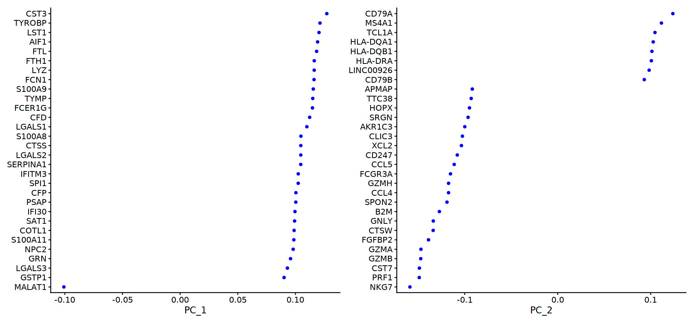
    


```R
DimPlot(pbmc, reduction = "pca")
```


    
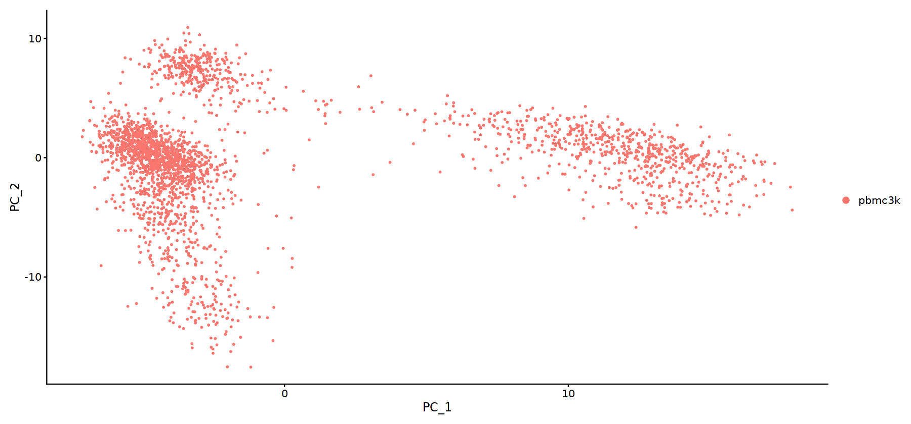
    


```R
DimHeatmap(pbmc, dims = 1, cells = 500, balanced = TRUE)
```


    
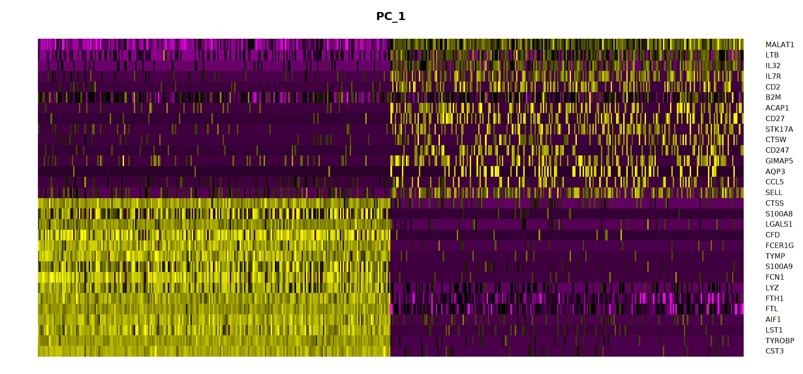
    


```R
DimHeatmap(pbmc, dims = 1:15, cells = 500, balanced = TRUE)
```


    
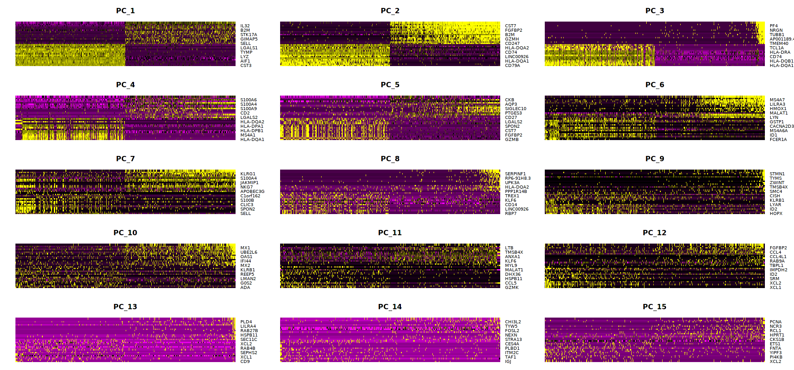
    


```R
# Determine the 'dimensionality' of the dataset

# NOTE: This process can take a long time for big datasets, comment out for expediency. More
# approximate techniques such as those implemented in ElbowPlot() can be used to reduce
# computation time
pbmc <- JackStraw(pbmc, num.replicate = 100)
pbmc <- ScoreJackStraw(pbmc, dims = 1:20)
```


```R
JackStrawPlot(pbmc, dims = 1:15)
```

    Warning message:
    “Removed 23504 rows containing missing values (geom_point).”


    
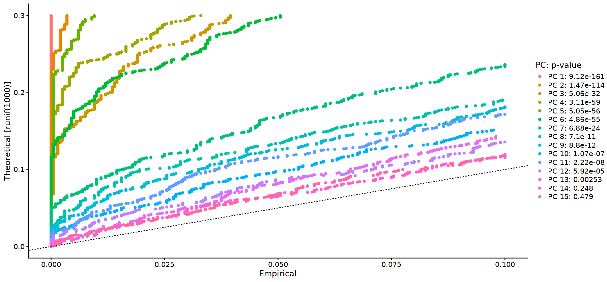
    


```R
ElbowPlot(pbmc)
```


    
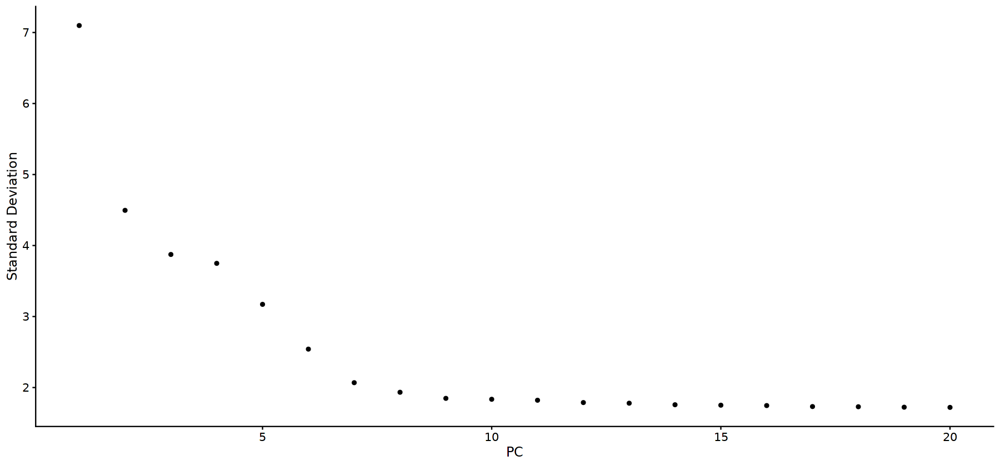
    


```R
# Cluster the cells

pbmc <- FindNeighbors(pbmc, dims = 1:10)
pbmc <- FindClusters(pbmc, resolution = 0.5)
```

    Computing nearest neighbor graph
    
    Computing SNN
    


    Modularity Optimizer version 1.3.0 by Ludo Waltman and Nees Jan van Eck
    
    Number of nodes: 2638
    Number of edges: 95858
    
    Running Louvain algorithm...
    Maximum modularity in 10 random starts: 0.8726
    Number of communities: 9
    Elapsed time: 0 seconds


```R
# Look at cluster IDs of the first 5 cells
head(Idents(pbmc), 5)
```


<style>
.dl-inline {width: auto; margin:0; padding: 0}
.dl-inline>dt, .dl-inline>dd {float: none; width: auto; display: inline-block}
.dl-inline>dt::after {content: ":\0020"; padding-right: .5ex}
.dl-inline>dt:not(:first-of-type) {padding-left: .5ex}
</style><dl class=dl-inline><dt>AAACATACAACCAC-1</dt><dd>2</dd><dt>AAACATTGAGCTAC-1</dt><dd>3</dd><dt>AAACATTGATCAGC-1</dt><dd>2</dd><dt>AAACCGTGCTTCCG-1</dt><dd>1</dd><dt>AAACCGTGTATGCG-1</dt><dd>6</dd></dl>

<details>
	<summary style=display:list-item;cursor:pointer>
		<strong>Levels</strong>:
	</summary>
	<style>
	.list-inline {list-style: none; margin:0; padding: 0}
	.list-inline>li {display: inline-block}
	.list-inline>li:not(:last-child)::after {content: "\00b7"; padding: 0 .5ex}
	</style>
	<ol class=list-inline><li>'0'</li><li>'1'</li><li>'2'</li><li>'3'</li><li>'4'</li><li>'5'</li><li>'6'</li><li>'7'</li><li>'8'</li></ol>
</details>


```R
# Run non-linear dimensional reduction (UMAP)
pbmc <- RunUMAP(pbmc, dims = 1:10)
```

    Warning message:
    “The default method for RunUMAP has changed from calling Python UMAP via reticulate to the R-native UWOT using the cosine metric
    To use Python UMAP via reticulate, set umap.method to 'umap-learn' and metric to 'correlation'
    This message will be shown once per session”
    19:23:18 UMAP embedding parameters a = 0.9922 b = 1.112
    
    19:23:18 Read 2638 rows and found 10 numeric columns
    
    19:23:18 Using Annoy for neighbor search, n_neighbors = 30
    
    19:23:18 Building Annoy index with metric = cosine, n_trees = 50
    
    0%   10   20   30   40   50   60   70   80   90   100%
    
    [----|----|----|----|----|----|----|----|----|----|
    
    *
    *
    *
    *
    *
    *
    *
    *
    *
    *
    *
    *
    *
    *
    *
    *
    *
    *
    *
    *
    *
    *
    *
    *
    *
    *
    *
    *
    *
    *
    *
    *
    *
    *
    *
    *
    *
    *
    *
    *
    *
    *
    *
    *
    *
    *
    *
    *
    *
    *
    |
    
    19:23:18 Writing NN index file to temp file /tmp/RtmpzoMRqB/file734f2cf706ce
    
    19:23:18 Searching Annoy index using 1 thread, search_k = 3000
    
    19:23:19 Annoy recall = 100%
    
    19:23:19 Commencing smooth kNN distance calibration using 1 thread
    
    19:23:20 Initializing from normalized Laplacian + noise
    
    19:23:20 Commencing optimization for 500 epochs, with 105220 positive edges
    
    19:23:23 Optimization finished
    


```R
# note that you can set `label = TRUE` or use the LabelClusters function to help label
# individual clusters
DimPlot(pbmc, reduction = "umap")
```


    
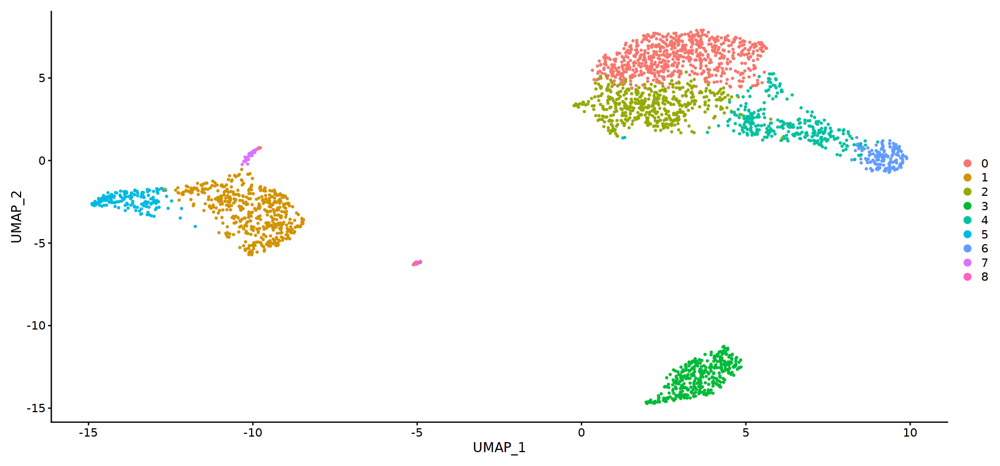
    


```R
# Run non-linear dimensional reduction (tSNE)
pbmc <- RunTSNE(pbmc, dims = 1:10)
```


```R
# note that you can set `label = TRUE` or use the LabelClusters function to help label
# individual clusters
DimPlot(pbmc, reduction = "tsne")
```


    
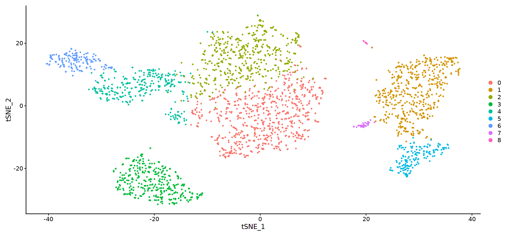
    


```R
# Save the progress so far
#saveRDS(pbmc, file = "../pbmc_tutorial.rds")
```


```R
# Finding differentially expressed features (cluster biomarkers)

# find all markers of cluster 1
cluster1.markers <- FindMarkers(pbmc, ident.1 = 1, min.pct = 0.25)
head(cluster1.markers, n = 5)
```


<table>
<caption>A data.frame: 5 × 5</caption>
<thead>
	<tr><th></th><th scope=col>p_val</th><th scope=col>avg_logFC</th><th scope=col>pct.1</th><th scope=col>pct.2</th><th scope=col>p_val_adj</th></tr>
	<tr><th></th><th scope=col>&lt;dbl&gt;</th><th scope=col>&lt;dbl&gt;</th><th scope=col>&lt;dbl&gt;</th><th scope=col>&lt;dbl&gt;</th><th scope=col>&lt;dbl&gt;</th></tr>
</thead>
<tbody>
	<tr><th scope=row>S100A9</th><td> 0.000000e+00</td><td>3.860873</td><td>0.996</td><td>0.215</td><td> 0.000000e+00</td></tr>
	<tr><th scope=row>S100A8</th><td> 0.000000e+00</td><td>3.796640</td><td>0.975</td><td>0.121</td><td> 0.000000e+00</td></tr>
	<tr><th scope=row>LGALS2</th><td> 0.000000e+00</td><td>2.634294</td><td>0.908</td><td>0.059</td><td> 0.000000e+00</td></tr>
	<tr><th scope=row>FCN1</th><td> 0.000000e+00</td><td>2.352693</td><td>0.952</td><td>0.151</td><td> 0.000000e+00</td></tr>
	<tr><th scope=row>CD14</th><td>2.856582e-294</td><td>1.951644</td><td>0.667</td><td>0.028</td><td>3.917516e-290</td></tr>
</tbody>
</table>


```R
# find all markers distinguishing cluster 5 from clusters 0 and 3
cluster5.markers <- FindMarkers(pbmc, ident.1 = 5, ident.2 = c(0, 3), min.pct = 0.25)
head(cluster5.markers, n = 5)
```


<table>
<caption>A data.frame: 5 × 5</caption>
<thead>
	<tr><th></th><th scope=col>p_val</th><th scope=col>avg_logFC</th><th scope=col>pct.1</th><th scope=col>pct.2</th><th scope=col>p_val_adj</th></tr>
	<tr><th></th><th scope=col>&lt;dbl&gt;</th><th scope=col>&lt;dbl&gt;</th><th scope=col>&lt;dbl&gt;</th><th scope=col>&lt;dbl&gt;</th><th scope=col>&lt;dbl&gt;</th></tr>
</thead>
<tbody>
	<tr><th scope=row>FCGR3A</th><td>1.219217e-204</td><td>2.953683</td><td>0.975</td><td>0.040</td><td>1.672034e-200</td></tr>
	<tr><th scope=row>CFD</th><td>1.757260e-194</td><td>2.369997</td><td>0.938</td><td>0.037</td><td>2.409907e-190</td></tr>
	<tr><th scope=row>IFITM3</th><td>2.082108e-194</td><td>2.682219</td><td>0.975</td><td>0.050</td><td>2.855402e-190</td></tr>
	<tr><th scope=row>CD68</th><td>4.234603e-191</td><td>2.093488</td><td>0.926</td><td>0.035</td><td>5.807335e-187</td></tr>
	<tr><th scope=row>RP11-290F20.3</th><td>3.667846e-186</td><td>1.885330</td><td>0.840</td><td>0.017</td><td>5.030084e-182</td></tr>
</tbody>
</table>


```R
# find markers for every cluster compared to all remaining cells, report only the positive ones
pbmc.markers <- FindAllMarkers(pbmc, only.pos = TRUE, min.pct = 0.25, logfc.threshold = 0.25)
pbmc.markers %>% group_by(cluster) %>% top_n(n = 2, wt = avg_logFC)
```

    Calculating cluster 0
    
    Calculating cluster 1
    
    Calculating cluster 2
    
    Calculating cluster 3
    
    Calculating cluster 4
    
    Calculating cluster 5
    
    Calculating cluster 6
    
    Calculating cluster 7
    
    Calculating cluster 8
    


<table>
<caption>A grouped_df: 18 × 7</caption>
<thead>
	<tr><th scope=col>p_val</th><th scope=col>avg_logFC</th><th scope=col>pct.1</th><th scope=col>pct.2</th><th scope=col>p_val_adj</th><th scope=col>cluster</th><th scope=col>gene</th></tr>
	<tr><th scope=col>&lt;dbl&gt;</th><th scope=col>&lt;dbl&gt;</th><th scope=col>&lt;dbl&gt;</th><th scope=col>&lt;dbl&gt;</th><th scope=col>&lt;dbl&gt;</th><th scope=col>&lt;fct&gt;</th><th scope=col>&lt;chr&gt;</th></tr>
</thead>
<tbody>
	<tr><td> 7.980793e-91</td><td>0.9534482</td><td>0.452</td><td>0.107</td><td> 1.094486e-86</td><td>0</td><td>CCR7    </td></tr>
	<tr><td> 5.679448e-32</td><td>0.7751959</td><td>0.252</td><td>0.083</td><td> 7.788795e-28</td><td>0</td><td>LDLRAP1 </td></tr>
	<tr><td> 0.000000e+00</td><td>3.8608733</td><td>0.996</td><td>0.215</td><td> 0.000000e+00</td><td>1</td><td>S100A9  </td></tr>
	<tr><td> 0.000000e+00</td><td>3.7966403</td><td>0.975</td><td>0.121</td><td> 0.000000e+00</td><td>1</td><td>S100A8  </td></tr>
	<tr><td> 1.986662e-87</td><td>0.8892711</td><td>0.981</td><td>0.643</td><td> 2.724508e-83</td><td>2</td><td>LTB     </td></tr>
	<tr><td> 4.353526e-61</td><td>0.8676191</td><td>0.427</td><td>0.110</td><td> 5.970426e-57</td><td>2</td><td>AQP3    </td></tr>
	<tr><td> 0.000000e+00</td><td>2.9875833</td><td>0.936</td><td>0.041</td><td> 0.000000e+00</td><td>3</td><td>CD79A   </td></tr>
	<tr><td>9.481783e-271</td><td>2.4894932</td><td>0.622</td><td>0.022</td><td>1.300332e-266</td><td>3</td><td>TCL1A   </td></tr>
	<tr><td>7.231983e-205</td><td>2.1603160</td><td>0.980</td><td>0.232</td><td>9.917942e-201</td><td>4</td><td>CCL5    </td></tr>
	<tr><td>4.533542e-170</td><td>2.1013122</td><td>0.579</td><td>0.054</td><td>6.217299e-166</td><td>4</td><td>GZMK    </td></tr>
	<tr><td>3.511192e-184</td><td>2.2954931</td><td>0.975</td><td>0.134</td><td>4.815249e-180</td><td>5</td><td>FCGR3A  </td></tr>
	<tr><td>2.025672e-125</td><td>2.1388125</td><td>1.000</td><td>0.315</td><td>2.778007e-121</td><td>5</td><td>LST1    </td></tr>
	<tr><td>1.305268e-265</td><td>3.3547398</td><td>0.961</td><td>0.069</td><td>1.790045e-261</td><td>6</td><td>GZMB    </td></tr>
	<tr><td>1.734960e-188</td><td>3.6648690</td><td>0.961</td><td>0.132</td><td>2.379324e-184</td><td>6</td><td>GNLY    </td></tr>
	<tr><td>1.480764e-220</td><td>2.6832771</td><td>0.812</td><td>0.011</td><td>2.030720e-216</td><td>7</td><td>FCER1A  </td></tr>
	<tr><td> 1.665286e-21</td><td>1.9924275</td><td>1.000</td><td>0.513</td><td> 2.283773e-17</td><td>7</td><td>HLA-DPB1</td></tr>
	<tr><td>7.731180e-200</td><td>5.0207262</td><td>1.000</td><td>0.010</td><td>1.060254e-195</td><td>8</td><td>PF4     </td></tr>
	<tr><td>3.684548e-110</td><td>5.9443347</td><td>1.000</td><td>0.024</td><td>5.052989e-106</td><td>8</td><td>PPBP    </td></tr>
</tbody>
</table>


```R
cluster1.markers <- FindMarkers(pbmc, ident.1 = 0, logfc.threshold = 0.25, test.use = "roc", only.pos = TRUE)
```


```R
VlnPlot(pbmc, features = c("MS4A1", "CD79A"))
```


    
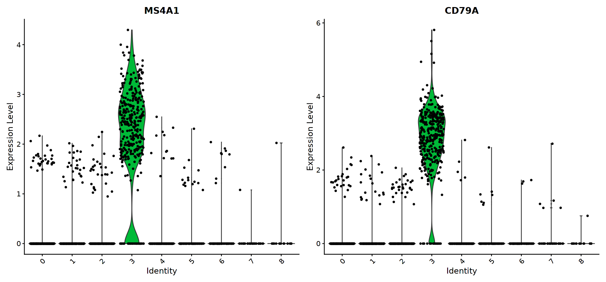
    


```R
# you can plot raw counts as well
VlnPlot(pbmc, features = c("NKG7", "PF4"), slot = "counts", log = TRUE)
```


    
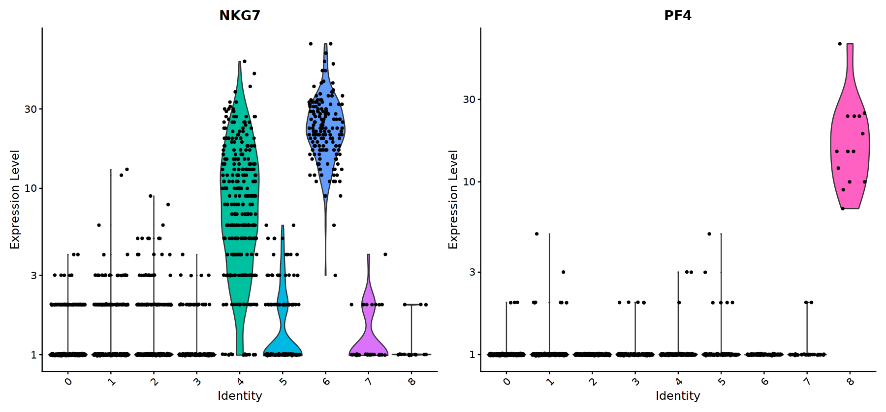
    


```R
FeaturePlot(pbmc, features = c("MS4A1", "GNLY", "CD3E", "CD14", "FCER1A", "FCGR3A", "LYZ", "PPBP", 
    "CD8A"))
```


    
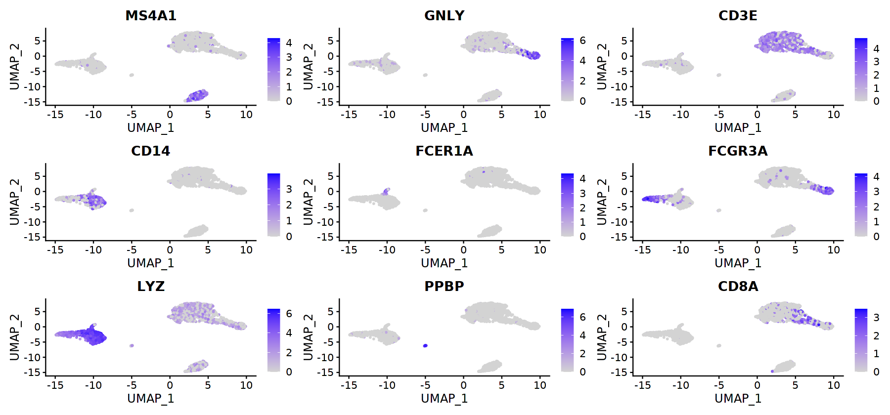
    


```R
top10 <- pbmc.markers %>% group_by(cluster) %>% top_n(n = 10, wt = avg_logFC)
DoHeatmap(pbmc, features = top10$gene) + NoLegend()
```


    
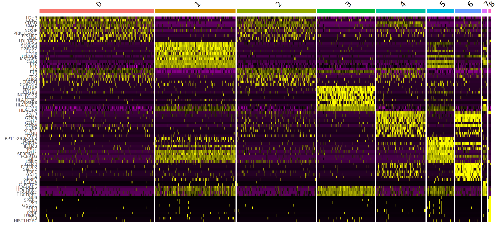
    


```R
new.cluster.ids <- c("Naive CD4 T", "Memory CD4 T", "CD14+ Mono", "B", "CD8 T", "FCGR3A+ Mono", 
    "NK", "DC", "Platelet")
names(new.cluster.ids) <- levels(pbmc)
pbmc <- RenameIdents(pbmc, new.cluster.ids)
DimPlot(pbmc, reduction = "umap", label = TRUE, pt.size = 0.5) + NoLegend()
```


    
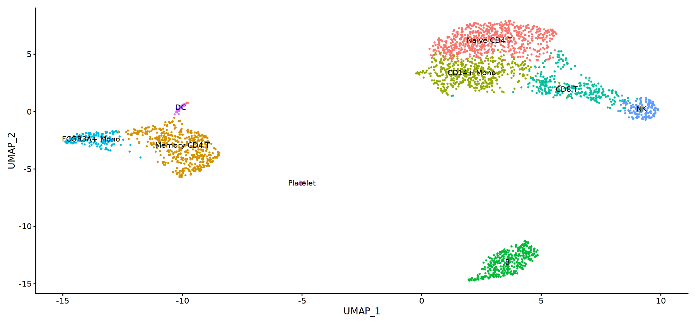
    


```R
# Save final results
# saveRDS(pbmc, file = "../output/pbmc3k_final.rds")
```


```R
# They don't use this plot in the orignal tutorial
DimPlot(pbmc, reduction = "tsne", label = TRUE, pt.size = 0.5) + NoLegend()
```


    
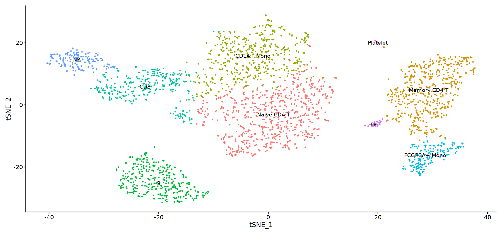
    


```R
proc.time() - ptm
```


       user  system elapsed 
    318.400  19.004 340.091 


```R

```
